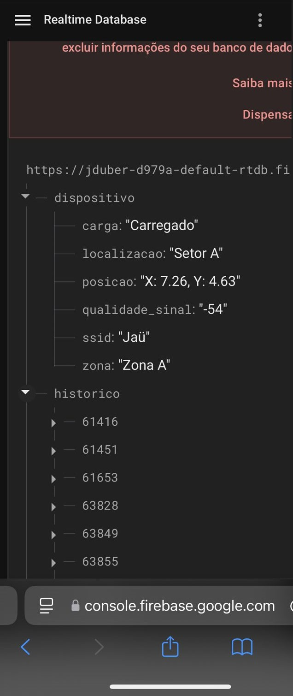
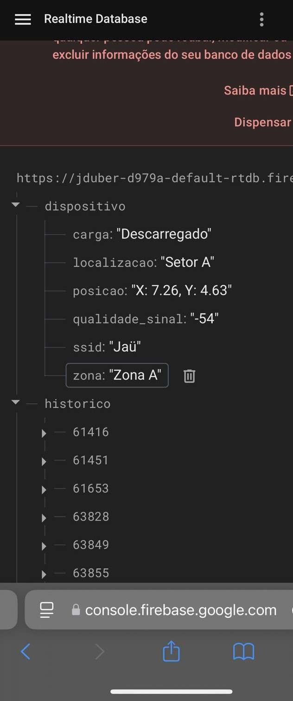

# Testes de desempenho

Antes de fazer os testes, vamos fazer um breve resumo do projeto em si:

A solução utiliza um ESP32 como dispositivo IoT para rastrear carrinhos na fábrica da John Deere. Os componentes incluem:
  - ESP32: Capta dados de localização e transmite via Wi-Fi.
  - Servidor: Hospedado na nuvem (AWS ou Firebase), armazena e processa os dados.
  - Frontend: Interface em HTML/CSS/JavaScript para exibir a localização em tempo real.
  - Plataforma IoT: Firebase ou Ubidots, para gerenciar dados do ESP32.
  - Mapbox: Para visualização de mapas indoor.
  - Hostinger: Hospedagem do site.
O ESP32 coleta dados de sensores nos carrinhos e envia ao servidor, que atualiza a localização dos carrinhos na interface. O sistema proporciona um rastreamento em tempo real eficiente para a fábrica.

Após o resumo, vamos fazer os testes.

a) Definição da Ferramenta de Teste
A ferramenta de teste utilizada no projeto John Deere é uma interface de mapeamento e monitoramento de veículos de carga na fábrica. Essa ferramenta permite simular e verificar o funcionamento de um sistema de localização em tempo real de carros-kits, empregando triangulação por Wi-Fi e sensores de ultrassom conectados a um ESP32. Ela permite identificar a presença de carga, a posição precisa do veículo no mapa interno da fábrica e exibe as informações coletadas diretamente na plataforma web.

Para o teste de conectividade e precisão do sistema, são utilizadas ferramentas de triangulação e o Firebase para armazenamento e recuperação de dados em tempo real. Essas verificações visam assegurar que o ESP32 (apelidado de Breno e Nunes) esteja se conectando corretamente ao Wi-Fi, recebendo e transmitindo dados sobre o status de carga e localização do carro de peças.

b) Evidências de Testes
Aqui estão algumas evidências do que foi realizado:

Conexão do ESP32 ao Firebase: Uma captura de tela mostrando a comunicação em tempo real com o Firebase, onde os dados de posição e status de carga são atualizados automaticamente conforme o carro se move ou detecta uma carga.

Detecção de Carga com Ultrassom: Captura de tela de um teste com o sensor de ultrassom indicando a presença de carga no carro. Com a presença de um objeto o sistema indicou “Carregado”; com a ausência de carga o status mudou para “Sem carga”.

 

c) Discussão dos Resultados
Os testes realizados apresentaram resultados satisfatórios para os objetivos principais:

Precisão da Localização: A triangulação por Wi-Fi exibiu boa precisão.
Conectividade e Sincronização: A comunicação em tempo real entre o ESP32 e o Firebase funcionou corretamente, com os dados sendo atualizados conforme esperado.
Detecção de Carga: O sensor de ultrassom respondeu conforme o planejado, com a detecção da carga, identificando adequadamente quando o carro estava carregado.
No entanto, pequenos atrasos na atualização da posição ocorreram em alguns momentos, o que poderia ser um problema em uma fábrica com alta movimentação.

d) Soluções Futuras
Para melhorar os testes, o grupo considera as seguintes propostas:

Otimização da Precisão da Triangulação: Investir em algoritmos mais robustos para melhorar a precisão da triangulação Wi-Fi, reduzindo o tempo de resposta da atualização de posição.

Implementação de Testes Automatizados: Criar scripts que simulem o movimento dos veículos e testes de carga repetitivos para avaliar a robustez da plataforma em cenários de uso contínuo.

Expansão para Diferentes Condições Ambientais: Realizar testes em condições de fábrica, como com interferências de outros dispositivos ou diferentes layouts físicos, para entender melhor o impacto ambiental na comunicação Wi-Fi.

Feedback Visual e Alerta de Anomalias: Implementar alertas de erro quando há inconsistências na posição ou se o veículo perde conexão, além de incluir feedback visual no mapa para sinalizar rapidamente eventuais falhas.

